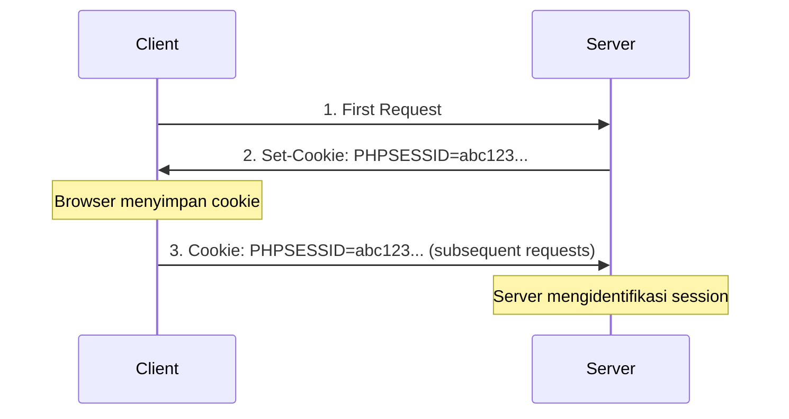

# Diskusi Pembelajaran: Session Management & Cookies

> **Konteks**: Analisis keamanan aplikasi Broken Authentication untuk pembelajaran cybersecurity
> **Tanggal**: 22 September 2025

---

## 📋 Daftar Isi
1. [Session ID vs Cookies](#1-session-id-vs-cookies)
2. [Cara Mendapatkan Session ID](#2-cara-mendapatkan-session-id)
3. [Demonstrasi Praktis](#3-demonstrasi-praktis)
4. [Kesimpulan](#4-kesimpulan)

---

## 1. Session ID vs Cookies

### ❓ **Pertanyaan**: Apakah Session ID = Cookies?

### 🔍 **Jawaban**: Session ID ≠ Cookies (Tapi Saling Terhubung)

| Aspek | Session ID | Cookies |
|-------|------------|---------|
| **Definisi** | Identifier unik yang dibuat server untuk mengidentifikasi session pengguna | Mekanisme penyimpanan data kecil di browser client |
| **Format** | String random yang unik<br/>*Contoh: `8ae7aee7ebad7d569f646bcb785550b3`* | Key-value pairs<br/>*Contoh: `PHPSESSID=8ae7aee7ebad7d569f646bcb785550b3`* |
| **Fungsi** | Menghubungkan request client dengan data session di server | Cara untuk menyimpan dan mengirim data antara client dan server |
| **Lokasi** | Server-side reference | Client-side storage |

### 🔄 **Cara Kerja Session ID + Cookies**



**Step by step:**
1. **Server Membuat Session**
   ```php
   session_start(); // Server generates session ID: abc123...
   ```

2. **Server Mengirim Cookie dengan Session ID**
   ```http
   HTTP Response:
   Set-Cookie: PHPSESSID=abc123...; Path=/; Domain=localhost
   ```

3. **Browser Menyimpan Cookie**
   ```javascript
   // Cookie tersimpan di browser:
   document.cookie // "PHPSESSID=abc123..."
   ```

4. **Browser Mengirim Cookie di Request Berikutnya**
   ```http
   HTTP Request:
   Cookie: PHPSESSID=abc123...
   ```

### 📋 **Format Cookie yang Ditemukan**
```
Domain    | Path | Secure | HttpOnly | Expires | Name      | Value (Session ID)
localhost | /    | FALSE  | FALSE    | 0       | PHPSESSID | 8ae7aee7ebad7d569f646bcb785550b3
```

### 🛡️ **Alternatif Cara Menyimpan Session ID**

| Metode | Status | Keamanan | Keterangan |
|--------|--------|----------|------------|
| **Via Cookies** | ✅ Recommended | Aman jika dikonfigurasi benar | Metode paling umum dan aman |
| **Via URL Parameter** | ❌ Tidak Aman | Sangat rentan | Mudah terekspos di logs, history |
| **Via Hidden Form Field** | ⚠️ Jarang | Terbatas | Hanya untuk form submission |

---

## 2. Cara Mendapatkan Session ID

### 🔧 **Normal Session ID Management**

Dalam aplikasi web yang aman, Session ID biasanya diperoleh melalui:

#### **1. Session Creation**
```php
// Server generates a cryptographically secure, random session ID
session_start(); // PHP automatically generates secure session ID
// Example: sess_a1b2c3d4e5f6g7h8i9j0k1l2m3n4o5p6
```

#### **2. Session ID Transmission**
Session ID biasanya ditransmisikan via:
- **HTTP Cookies** (paling umum dan aman)
- **URL parameters** (kurang aman, tidak disarankan)
- **Hidden form fields** (jarang digunakan)

#### **3. Secure Session Configuration**
```php
// Konfigurasi session yang aman
ini_set('session.cookie_httponly', 1);  // Prevent XSS access
ini_set('session.cookie_secure', 1);    // HTTPS only
ini_set('session.use_strict_mode', 1);  // Prevent session fixation
ini_set('session.cookie_samesite', 'Strict'); // CSRF protection
```

### 🔍 **Metode Mendapatkan Session ID**

#### **A. Browser Developer Tools**
1. Buka **DevTools** (F12)
2. Go to **Application/Storage** tab
3. Look under **Cookies** for your domain
4. Session ID typically appears as `PHPSESSID` cookie

#### **B. Via HTTP Headers**
```bash
curl -I http://localhost:8081
# Look for: Set-Cookie: PHPSESSID=...
```

#### **C. JavaScript Console**
```javascript
// Melihat semua cookies
console.log(document.cookie);

// Mengambil cookie spesifik
function getCookie(name) {
    const value = `; ${document.cookie}`;
    const parts = value.split(`; ${name}=`);
    if (parts.length === 2) return parts.pop().split(';').shift();
}

console.log("Session ID:", getCookie('PHPSESSID'));
```

### 🚨 **Kerentanan dalam Broken Auth Application**

#### **Session Fixation Vulnerability**
```php
// VULNERABLE CODE di index.php
if (isset($_GET['sessionid'])) {
    session_id($_GET['sessionid']); // Allows session fixation!
    session_start();
}
```
**Attack Vector**: `http://localhost:8081?sessionid=ATTACKER_SESSION`

#### **Insecure Cookie Settings**
```php
// VULNERABLE CONFIGURATION di config.php
ini_set('session.cookie_httponly', 0); // JS can access cookies
ini_set('session.cookie_secure', 0);   // Works over HTTP
ini_set('session.use_strict_mode', 0); // Accepts any session ID
```

#### **Missing Security Features**
- ❌ No session regeneration after login
- ❌ Session ID exposed in JavaScript console
- ❌ Plaintext password storage
- ❌ No rate limiting for brute force protection

---

## 3. Demonstrasi Praktis

### 🔬 **Hasil Testing dengan cURL**

#### **Mendapatkan Cookie dari Server**


```bash
# Request pertama untuk mendapatkan session
curl -v http://localhost:8081 2>&1 | grep "Set-Cookie"
```
**Output:**
```
< Set-Cookie: PHPSESSID=53d31c822d410714471db554b803abb0; path=/
Session Cookie: HttpOnly=false, Secure=false
```

#### **Mengirim Cookie Kembali ke Server**
```bash
# Menggunakan session ID yang sudah diperoleh
curl -b "PHPSESSID=53d31c822d410714471db554b803abb0" -v http://localhost:8081 2>&1 | grep "Cookie:"
```
**Output:**
```
> Cookie: PHPSESSID=53d31c822d410714471db554b803abb0
Session Cookie: HttpOnly=false, Secure=false
```

#### **Menyimpan dan Membaca Cookies dari File**
```bash
# Simpan cookies ke file
curl -c cookies.txt -b cookies.txt http://localhost:8081 2>/dev/null | grep -i session

# Baca isi file cookies
cat cookies.txt | tail -2
```
**Output:**
```
localhost   FALSE   /   FALSE   0   PHPSESSID   8ae7aee7ebad7d569f646bcb785550b3
```

### 📊 **Session ID yang Teridentifikasi**

| Testing Round | Session ID | Method |
|---------------|------------|--------|
| **Test 1** | `8ae7aee7ebad7d569f646bcb785550b3` | Browser access |
| **Test 2** | `53d31c822d410714471db564b803abb0` | cURL request |
| **Test 3** | `4e9888a7c46f1ee4f3a35030b3c330cd` | cURL with cookie file |

### 🔓 **Kerentanan yang Terdeteksi**

#### **1. Session ID Exposed in JavaScript**
```javascript
// Vulnerability: Session ID exposed to JavaScript
console.log("Session ID exposed in JS:", "<?php echo session_id(); ?>");
```

#### **2. Session Fixation Attack Vector**
```
Attack URL: http://localhost:8081?sessionid=ATTACKER_SESSION_ID
```

**⚠️ Catatan Penting**: Implementasi session fixation di aplikasi ini **tidak berfungsi dengan benar** karena masalah urutan eksekusi:

**Masalah Implementation:**
```php
// Di config.php (line 22)
session_start(); // ← Session dimulai pertama kali di sini

// Di index.php (line 9-10) 
if (isset($_GET['sessionid'])) {
    session_id($_GET['sessionid']); // ← ERROR! Session sudah aktif
    session_start(); // ← ERROR! Session sudah dimulai
}
```

**Error yang Muncul:**
```
Warning: session_id(): Session ID cannot be changed when a session is active
Notice: session_start(): Ignoring session_start() because a session is already active
```

**Implementasi yang Benar untuk Session Fixation:**
```php
// Yang SEHARUSNYA terjadi:
if (isset($_GET['sessionid'])) {
    session_id($_GET['sessionid']); // Set SEBELUM session start
}
session_start(); // Baru mulai session dengan ID yang sudah ditetapkan
```

**Impact**: Meskipun ada error, konsep session fixation tetap berbahaya jika diimplementasikan dengan benar. Attacker bisa memfiksasi session ID dan hijack session setelah user login.

#### **3. Insecure Cookie Configuration**
```
HttpOnly: false  ← JavaScript dapat mengakses cookie
Secure: false    ← Cookie dikirim melalui HTTP (tidak aman)
SameSite: none   ← Tidak ada perlindungan CSRF
```

---

## 4. Kesimpulan

### 🎯 **Key Takeaways**

#### **Session ID vs Cookies - Relationship**
```
┌─────────────────┐    ┌──────────────────────┐
│   Session ID    │    │       Cookies        │
│                 │    │                      │
│ • Identifier    │◄──►│ • Storage Mechanism  │
│ • Server-side   │    │ • Client-side        │ 
│ • Data pointer  │    │ • Transport method   │
└─────────────────┘    └──────────────────────┘
```

#### **Analogi Sederhana**
- **Session ID** = Nomor tiket unik untuk mengidentifikasi session Anda
- **Cookie** = Amplop yang membawa nomor tiket itu antara browser dan server
- **Keduanya bekerja sama** untuk mempertahankan state login Anda!

### 🛡️ **Best Practices untuk Production**

#### **Secure Session Configuration**
```php
// Konfigurasi yang AMAN
ini_set('session.cookie_httponly', 1);     // XSS protection
ini_set('session.cookie_secure', 1);       // HTTPS only
ini_set('session.use_strict_mode', 1);     // Prevent fixation
ini_set('session.cookie_samesite', 'Strict'); // CSRF protection
ini_set('session.gc_maxlifetime', 3600);   // Session timeout

// Regenerate session ID after login
session_regenerate_id(true);
```

#### **Security Checklist**
- ✅ Use HTTPS for all authenticated pages
- ✅ Set `HttpOnly` flag on session cookies
- ✅ Set `Secure` flag for HTTPS-only cookies
- ✅ Implement proper session timeout
- ✅ Regenerate session ID after authentication
- ✅ Use strong random session ID generation
- ✅ Implement logout functionality that destroys sessions

### ⚠️ **Vulnerabilities dalam Broken Auth App**

| Vulnerability | Impact | Risk Level |
|---------------|--------|------------|
| **Session Fixation** | Session hijacking | 🔴 High |
| **No HttpOnly Flag** | XSS session theft | 🔴 High |
| **No Secure Flag** | Network interception | 🟡 Medium |
| **JavaScript Exposure** | Client-side access | 🟡 Medium |
| **No Session Regeneration** | Session persistence | 🟡 Medium |

### 📚 **Sumber Pembelajaran**

- **OWASP Session Management**: https://owasp.org/www-community/attacks/Session_fixation
- **PHP Session Security**: https://www.php.net/manual/en/session.security.php
- **MDN Cookies Guide**: https://developer.mozilla.org/en-US/docs/Web/HTTP/Cookies

---

> **⚠️ Disclaimer**: Aplikasi ini sengaja dibuat vulnerable untuk tujuan pembelajaran cybersecurity. Jangan gunakan pattern yang sama di environment production!

> **🎓 Educational Purpose**: File ini dibuat untuk dokumentasi pembelajaran tentang session management dan cookie security dalam konteks aplikasi web yang rentan.